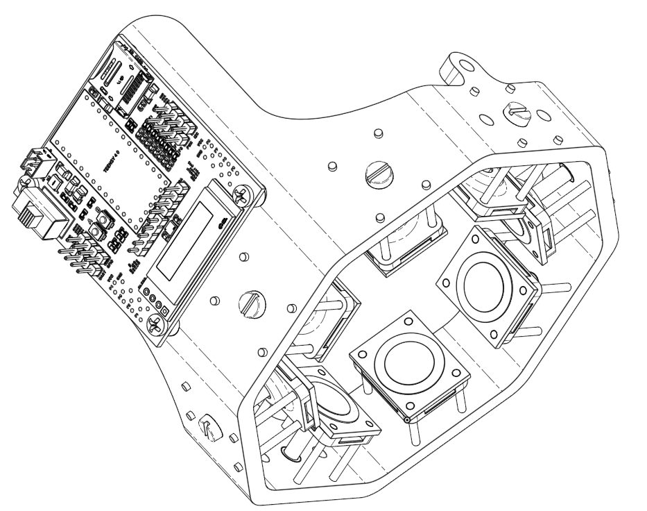
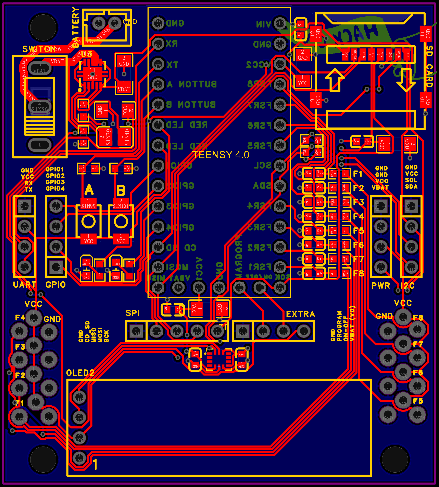
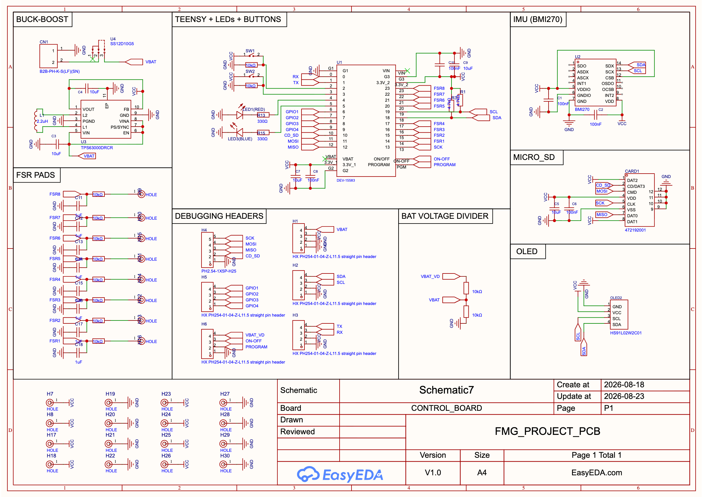
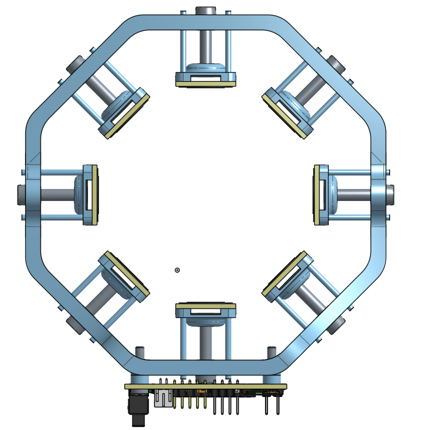

# Novel FMG Band

A wearable Force Myography band that uses pressure measurements around the forearm to predict your hand movements! This technology can help in prosthetics, robotics control, and other HMI applications.

The core research investigates how sensor compression affects FMG accuracy and repeatability. This is almost never studied in current literature.

## Research

### Research questions

* How does sensor compression affect FMG gesture recognition accuracy?
* How does regulating compression between don/doff cycles affect the sensor's drift?

### Hypothesis

A moderate level of compression will produce the highest accuracy by providing consistent sensor contact without saturating the FMG signal.

The `/research` folder contains a one-page PDF explaining the research concept in more detail :)

## Hardware

### PCB

* **Teensy 4.0** — extremely fast microcontroller for real-time processing
* **8× Alpha FSRs** — pressure sensing around the forearm
* **BMI270 IMU** — tracks limb position
* **128×32 OLED** — displays system information
* **MicroSD card** — stores sensor data
* **TPS63000 buck-boost converter**
* **RC low-pass filters** on FSR inputs
* **Inverting op-amp stages** for FSR signal conditioning
* **3.7 V 2000 mAh LiPo** power
* **Breakout headers** for I²C, SPI, UART, GPIO, and power

### Mechanical Design

The band uses a rigid structure with 8 individually adjustable screw-driven plungers that control the compression of each FSR individually. This allows me to study how the pressure of the band effects the accuracy.

Additionally when the FSRs are retracted, it is wide enough to easily slip on the band.

## Firmware

The band:

1. Collects FSR and IMU measurements extremely fast (600 MHz!).
2. Displays system information on the OLED screen (And what gestures the participants should perform).
3. Stores data on the MicroSD card (for training the model in the future!).
4. Uses collected data to train a neural network on my computer.
5. Loads the trained model onto the Teensy 4.0 for real-time gesture classification.

## Project Status

This project is currently still in the design phase.

CAD files, PCB designs, and the BOM are all in this repository for anyone who was inspired by this design or want to build it.

## Future Work

* Build a prosthetic hand controlled by the FMG band.
* Investigate additional issues with FMG.
* Make prosthetic control more affordable and reliable.

## Acknowledgments

Special thanks to Dr. Young and Dr. Stierotowicz for advising this project.

Special thanks to Hack Club for funding this and many other projects.
