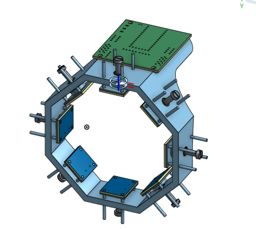
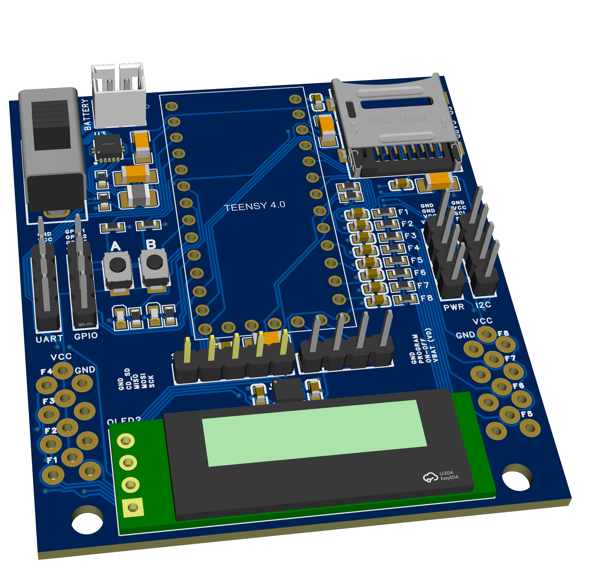

# Novel FMG Band




This is a novel Force Myography band that is able to 'predict' your hand movements, even if you are an amputee!

It works by analyzing the pressure around your forearm using force-sensitive resistors and training a model based on that data.

It is a revolutionary concept for cheap, accurate prosthetic control that has only recently entered the literature.

My project not only builds and tests one, but also has a novel feature that I am going to study and perform research on.

In the future, I would love to build a full prosthetic hand that I can control using this band.

**-----------**

## Features

PCB:

- OLED display!

- Teensy 4.0: an absolute power beast to control prosthetics super fast (600MHz)

- MicroSD card slot for saving data

- BMI270 IMU to correct for the limb position effect.

- 8 Alpha FSRs (from Adafruit; comparable to FSR402) to get pressure points all around your wrist.

- Breakout headers for debugging (I2C, SPI, UART, GPIO, POWER, etc.)

- Powered using a 3.7V LiPo (2000 mAh)

- Inverting Op-Amp to linearize FSR output.

- Innovative dual PCB design

CAD

- 8 individually controlled screw-based plungers that drive each sensor into the skin

```
\- this allows me to measure the effect of sensor compression on the accuracy of FMG bands -- something never done in the literature!
```

- A novel rigid design for the band

```
\- moves away from confounding strap designs and keeps measurements rock solid

\- rigid band is held up using an adjustable rig for collecting data
```

Firmware:

- band collects FSR and IMU data, and pushes that data as well as other important information onto the OLED and SD Card.

- Once data from a few participants is collected, the model will be trained on my computer and then the weights for the neural network will be transferred back onto the SD card or Teensy flash

- Then the Teensy can use the trained model to predict your gestures in real time.

**-----------**

## More About the Research

### Research Questions:

How does the compression of a Force Myography band affect the accuracy of the system using force-sensitive resistors?

How does regulating the amount of compression between don/doff cycles affect sensor drift over time?

### Research Hypothesis:

My hypothesis is that a moderate amount of compression will result in a peak in the accuracy of the system, as it will balance proper sensor contact without killing the signals.

If you want to read more about what I hope to accomplish with the research, I have left a short PDF covering the core ideas in the /research folder.

**-----------**

## PCB


My PCB combines the major components while staying compact and avoiding analog-digital crosstalk.

Key components:

- TPS63000 buck-boost converter

- Teensy 4.0 dev board

- Adafruit Alpha FSR

- BMI270

- 128 * 32 OLED screen

- Micro_SD card (SPI)

- RC filters (low-pass) on FSR lines

- Inverting Op-Amp for each FSR

**------------**

## Get started!

This project is not yet completed, but if you would like to take inspiration or even build it, all the CAD models are in /CAD. You can also view the BOM in order to purchase the right amount of everything.

I have split the BOM into basic materials to buy, and in-depth lists for components for both PCBs!

**------------**

## Future Work & Thanks

Short-term future goal:

Build a prosthetic hand to control with my band!

Long-term goal:

Help make prosthetics more affordable and reliable for amputees around the globe

Thanks:

Special thanks to Dr. Young and Dr. Stierotowicz for advising me on this project.

Special thanks to Hack Club for funding this and many other projects.
